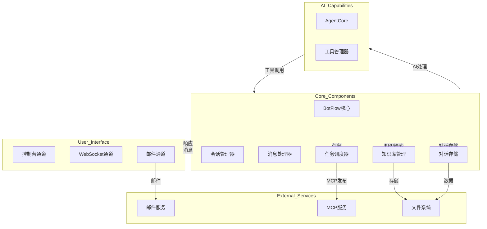
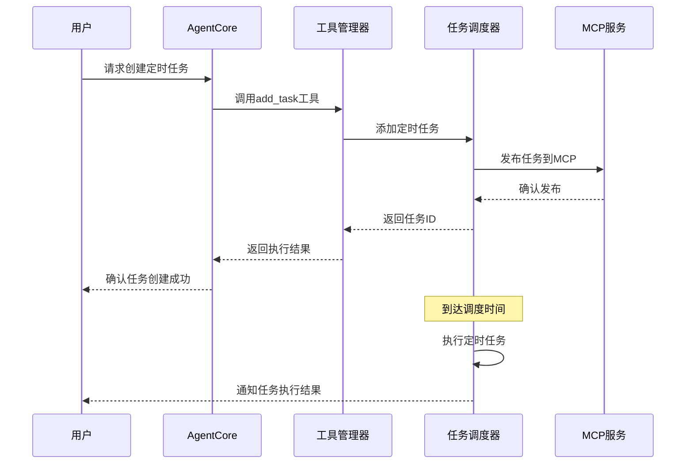
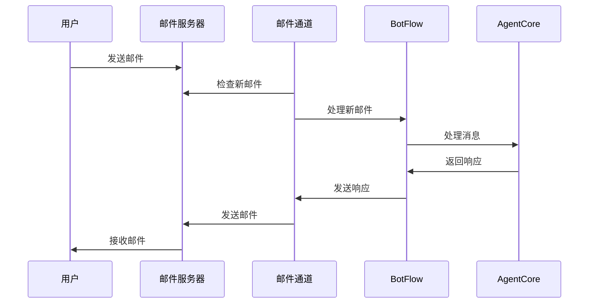
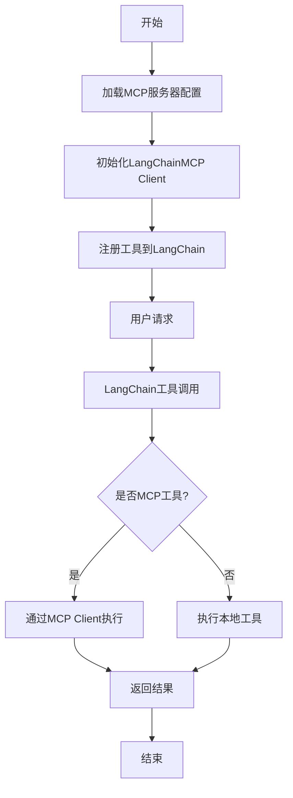
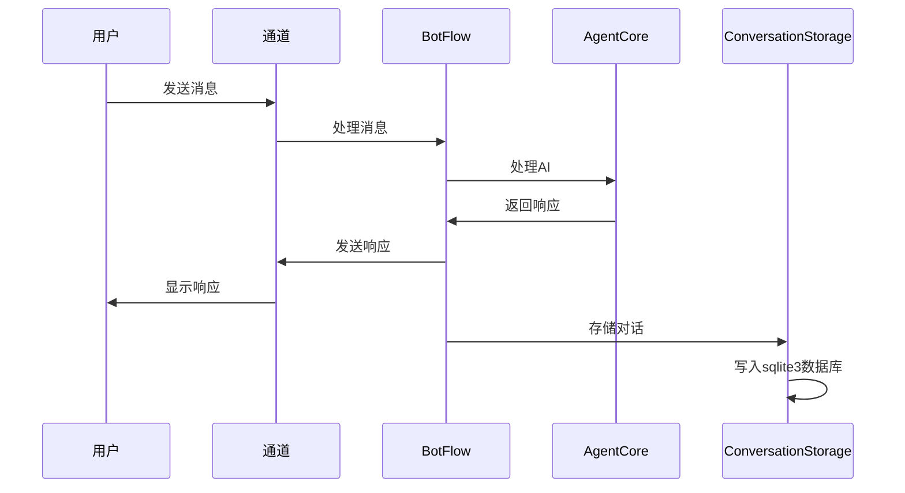

# OpenBot v0.2.0 详细设计文档

## 1. 版本信息
- **版本号**: v0.2.0
- **设计日期**: 2026-02-21
- **开发状态**: 进行中

## 2. 设计背景
根据v0.2.0需求文档，本设计文档详细描述了OpenBot v0.2.0版本的技术实现方案，包括任务调度器系统优化、邮件通道实现、知识库管理提升、用户体验优化以及系统稳定性和性能增强等功能的设计细节。

## 3. 系统架构

### 3.1 整体架构
OpenBot v0.2.0系统架构基于现有的模块化设计，进一步扩展和优化各个组件。系统主要由以下核心模块组成：



### 3.2 模块关系
- **BotFlow**: 核心协调模块，管理所有通道、会话和任务
- **SessionManager**: 管理用户会话状态和上下文
- **MessageProcessor**: 处理消息的预处理和后处理
- **TaskScheduler**: 优化的任务调度器，支持定时任务和MCP发布
- **KnowledgeBase**: 增强的知识库管理系统，支持文档上传和智能检索
- **AgentCore**: 基于DeepAgents的AI核心
- **ToolManager**: 管理工具的注册和调用
- **ConsoleChannel**: 控制台通道，提供命令行交互
- **WebSocketChannel**: WebSocket通道，提供实时交互
- **EmailChannel**: 新增的邮件通道，支持邮件交互
- **ConversationStorage**: 对话存储模块，将每一轮大模型的对话存储到sqlite3数据库中

## 4. 详细设计

### 4.1 任务调度器系统优化

#### 4.1.1 模块设计
- **模块名称**: TaskScheduler
- **文件路径**: `src/openbot/botflow/task.py`
- **核心功能**: 管理任务队列和执行，支持定时任务和MCP发布

#### 4.1.2 类设计

| 类名 | 职责 | 方法 | 属性 |
|------|------|------|------|
| `Task` | 任务基类 | `execute()`, `to_dict()`, `from_dict()` | `id`, `name`, `priority`, `status`, `created_at`, `scheduled_at` |
| `TaskScheduler` | 任务调度器 | `add_task()`, `remove_task()`, `get_task()`, `get_tasks()`, `start()`, `stop()` | `tasks`, `task_queue`, `running`, `mcp_client` |
| `MCPTaskPublisher` | MCP任务发布器 | `publish_task()`, `subscribe_tasks()` | `client`, `topic` |

#### 4.1.3 工具设计

| 工具名称 | 功能 | 参数 | 返回值 |
|---------|------|------|--------|
| `add_task` | 添加定时任务 | `name: str`, `schedule: str`, `priority: int`, `data: dict` | `task_id: str` |
| `list_tasks` | 列出所有任务 | `status: str` | `tasks: list` |
| `cancel_task` | 取消任务 | `task_id: str` | `success: bool` |

#### 4.1.4 流程图



### 4.2 邮件通道实现

#### 4.2.1 模块设计
- **模块名称**: EmailChannel
- **文件路径**: `src/openbot/channels/email.py`
- **核心功能**: 支持通过邮件发送和接收消息

#### 4.2.2 类设计

| 类名 | 职责 | 方法 | 属性 |
|------|------|------|------|
| `EmailChannel` | 邮件通道 | `__init__()`, `start()`, `stop()`, `send()`, `send_stream()`, `check_emails()` | `config`, `smtp_client`, `imap_client`, `running` |
| `EmailMessage` | 邮件消息 | `__init__()`, `to_email()`, `from_email()` | `subject`, `body`, `sender`, `recipient`, `attachments` |
| `EmailTemplate` | 邮件模板 | `render()`, `load()`, `save()` | `name`, `subject`, `body` |

#### 4.2.3 配置设计

| 配置项 | 类型 | 默认值 | 描述 |
|--------|------|--------|------|
| `smtp_server` | str | "smtp.gmail.com" | SMTP服务器地址 |
| `smtp_port` | int | 587 | SMTP服务器端口 |
| `smtp_username` | str | "" | SMTP用户名 |
| `smtp_password` | str | "" | SMTP密码 |
| `imap_server` | str | "imap.gmail.com" | IMAP服务器地址 |
| `imap_port` | int | 993 | IMAP服务器端口 |
| `imap_username` | str | "" | IMAP用户名 |
| `imap_password` | str | "" | IMAP密码 |
| `check_interval` | int | 60 | 邮件检查间隔(秒) |

#### 4.2.4 流程图



### 4.3 知识库管理提升

#### 4.3.1 模块设计
- **模块名称**: KnowledgeBase
- **文件路径**: `src/openbot/botflow/knowledge.py`
- **核心功能**: 管理知识库，支持文档上传和智能检索

#### 4.3.2 类设计

| 类名 | 职责 | 方法 | 属性 |
|------|------|------|------|
| `KnowledgeBase` | 知识库管理 | `add_document()`, `remove_document()`, `search()`, `get_document()` | `documents`, `index` |
| `Document` | 文档类 | `__init__()`, `to_dict()`, `from_dict()` | `id`, `title`, `content`, `metadata`, `created_at` |
| `DocumentIndex` | 文档索引 | `index()`, `search()`, `update()` | `index` |

#### 4.3.3 工具设计

| 工具名称 | 功能 | 参数 | 返回值 |
|---------|------|------|--------|
| `upload_document` | 上传文档 | `file_path: str`, `title: str`, `tags: list` | `document_id: str` |
| `search_knowledge` | 搜索知识库 | `query: str`, `limit: int` | `results: list` |
| `list_documents` | 列出文档 | `tags: list`, `limit: int` | `documents: list` |

#### 4.3.4 数据结构

| 数据结构 | 类型 | 描述 |
|---------|------|------|
| `Document` | 类 | 表示知识库中的文档 |
| `DocumentMetadata` | 字典 | 文档元数据，包含标签、作者等信息 |
| `SearchResult` | 字典 | 搜索结果，包含文档ID、标题、相似度等 |

### 4.4 工具使用能力增强

#### 4.4.1 模块设计
- **模块名称**: LangChainMCPToolManager
- **文件路径**: `src/openbot/agents/tool.py`
- **核心功能**: 使用langchain_mcp的client实现工具管理，支持通用的MCP服务器配置格式

#### 4.4.2 类设计

| 类名 | 职责 | 方法 | 属性 |
|------|------|------|------|
| `LangChainMCPToolManager` | 基于langchain_mcp的工具管理器 | `__init__()`, `load_mcp_config()`, `get_tools()` | `mcp_client`, `mcp_configs` |
| `MCPTool` | MCP工具类 | `run()`, `from_config()` | `name`, `description`, `parameters`, `mcp_server` |
| `MCPConfig` | MCP配置类 | `__init__()`, `to_json()`, `from_json()` | `servers` |

#### 4.4.3 MCP服务器配置设计

##### 4.4.3.1 通用配置格式

```json
{
  "mcpServers": {
    "GitHub": {
      "command": "npx",
      "args": [
        "-y",
        "@modelcontextprotocol/server-github"
      ],
      "env": {
        "GITHUB_PERSONAL_ACCESS_TOKEN": ""
      }
    },
    "OpenBot": {
      "command": "python",
      "args": [
        "-m",
        "openbot",
        "mcp"
      ],
      "env": {}
    }
  }
}
```

#### 4.4.4 工作流程



### 4.5 用户体验优化

#### 4.5.1 交互对话界面优化
- **模块名称**: ConsoleChannel
- **文件路径**: `src/openbot/channels/console.py`
- **核心功能**: 提供更友好的控制台交互界面

##### 4.5.1.1 增强功能
- 支持彩色输出和格式化显示
- 提供命令自动补全
- 支持历史命令查询
- 实现进度条显示

#### 4.5.2 进度可视化
- **模块名称**: ProgressMonitor
- **文件路径**: `src/openbot/utils/progress.py`
- **核心功能**: 提供任务进度的可视化显示

##### 4.5.2.1 类设计

| 类名 | 职责 | 方法 | 属性 |
|------|------|------|------|
| `ProgressMonitor` | 进度监视器 | `update()`, `complete()`, `get_progress()` | `task_id`, `total`, `current`, `status` |
| `ProgressBar` | 进度条 | `update()`, `render()` | `width`, `progress`, `message` |

#### 4.5.3 错误处理改进
- **模块名称**: ErrorHandler
- **文件路径**: `src/openbot/utils/error.py`
- **核心功能**: 提供更友好的错误处理和提示

##### 4.5.3.1 类设计

| 类名 | 职责 | 方法 | 属性 |
|------|------|------|------|
| `ErrorHandler` | 错误处理器 | `handle()`, `format_error()`, `get_suggestion()` | `errors` |
| `Error` | 错误类 | `__init__()`, `to_dict()` | `code`, `message`, `details`, `suggestion` |

### 4.6 系统稳定性和性能增强

#### 4.6.1 容错机制
- **模块名称**: FaultTolerance
- **文件路径**: `src/openbot/utils/fault.py`
- **核心功能**: 提供系统级别的容错机制

##### 4.6.1.1 类设计

| 类名 | 职责 | 方法 | 属性 |
|------|------|------|------|
| `FaultTolerance` | 容错管理器 | `wrap()`, `retry()`, `fallback()` | `policies` |
| `RetryPolicy` | 重试策略 | `should_retry()`, `get_delay()` | `max_retries`, `delay` |
| `CircuitBreaker` | 断路器 | `execute()`, `reset()` | `state`, `failure_threshold` |

#### 4.6.2 性能监控
- **模块名称**: PerformanceMonitor
- **文件路径**: `src/openbot/utils/performance.py`
- **核心功能**: 提供系统性能的监控和分析

##### 4.6.2.1 类设计

| 类名 | 职责 | 方法 | 属性 |
|------|------|------|------|
| `PerformanceMonitor` | 性能监视器 | `start()`, `stop()`, `record()` | `metrics` |
| `Metric` | 指标类 | `update()`, `get_value()` | `name`, `value`, `unit` |

### 4.7 对话存储功能

#### 4.7.1 模块设计
- **模块名称**: ConversationStorage
- **文件路径**: `src/openbot/botflow/conversation.py`
- **核心功能**: 将每一轮大模型的对话存储到sqlite3数据库中

#### 4.7.2 类设计

| 类名 | 职责 | 方法 | 属性 |
|------|------|------|------|
| `ConversationStorage` | 对话存储管理器 | `__init__()`, `save_conversation()`, `get_conversations()`, `export_conversations()` | `db_path`, `conn`, `cursor` |
| `Conversation` | 对话类 | `__init__()`, `to_dict()`, `from_dict()` | `id`, `session_id`, `channel`, `user_message`, `bot_message`, `timestamp` |

#### 4.7.3 数据库设计

##### 4.7.3.1 表结构

**`conversations`表**

| 字段名 | 数据类型 | 约束 | 描述 |
|--------|---------|------|------|
| `id` | `INTEGER` | `PRIMARY KEY AUTOINCREMENT` | 对话ID |
| `session_id` | `TEXT` | `NOT NULL` | 会话ID |
| `channel` | `TEXT` | `NOT NULL` | 通道类型 |
| `user_message` | `TEXT` | `NOT NULL` | 用户消息 |
| `bot_message` | `TEXT` | `NOT NULL` | 机器人消息 |
| `timestamp` | `TIMESTAMP` | `DEFAULT CURRENT_TIMESTAMP` | 对话时间戳 |
| `metadata` | `TEXT` | | 附加元数据（JSON格式） |

#### 4.7.4 工具设计

| 工具名称 | 功能 | 参数 | 返回值 |
|---------|------|------|--------|
| `get_conversations` | 获取对话历史 | `session_id: str`, `limit: int` | `conversations: list` |
| `export_conversations` | 导出对话数据 | `format: str`, `file_path: str` | `success: bool` |
| `clear_conversations` | 清除对话历史 | `session_id: str` | `success: bool` |

#### 4.7.5 流程图



## 5. 技术实现

### 5.1 任务调度器系统优化
- **技术选型**: 
  - 使用`asyncio`进行异步任务调度
  - 使用`pydantic`进行数据验证
  - 使用`vxutils`提供的MCP客户端
- **实现步骤**:
  1. 扩展`Task`类，添加定时任务支持
  2. 实现`TaskScheduler.add_task()`方法
  3. 实现`MCPTaskPublisher`类
  4. 开发`add_task`工具
  5. 测试任务调度和MCP发布功能

### 5.2 邮件通道实现
- **技术选型**:
  - 使用`smtplib`和`imaplib`实现邮件功能
  - 使用`email`库处理邮件格式
  - 使用`asyncio`进行异步邮件处理
- **实现步骤**:
  1. 创建`EmailChannel`类，继承自`ChatChannel`
  2. 实现邮件发送和接收功能
  3. 添加邮件模板管理
  4. 配置邮件通道参数
  5. 测试邮件通道功能

### 5.3 知识库管理提升
- **技术选型**:
  - 使用`langchain`的文档加载器
  - 使用`faiss`进行向量索引
  - 使用`os`和`shutil`进行文件管理
- **实现步骤**:
  1. 创建`KnowledgeBase`类
  2. 实现文档上传和管理功能
  3. 实现文档索引和搜索功能
  4. 开发知识库相关工具
  5. 测试知识库功能

### 5.4 工具使用能力增强
- **技术选型**:
  - 使用`langchain_mcp`的client实现MCP工具管理
  - 使用`langchain`的工具调用能力
  - 使用`pydantic`进行工具参数验证
  - 使用`asyncio`进行异步工具调用
  - 使用`json`进行MCP服务器配置管理
- **实现步骤**:
  1. 创建`LangChainMCPToolManager`类，集成langchain_mcp的client
  2. 实现MCP服务器配置加载功能，支持通用配置格式
  3. 初始化langchain_mcp client并连接到配置的MCP服务器
  4. 注册工具到langchain的工具列表
  5. 测试langchain_mcp工具调用功能
  6. 测试MCP服务器配置和连接

### 5.5 用户体验优化
- **技术选型**:
  - 使用`rich`库提供彩色输出和进度条
  - 使用`prompt-toolkit`提供命令自动补全
- **实现步骤**:
  1. 优化`ConsoleChannel`类
  2. 创建`ProgressMonitor`类
  3. 创建`ErrorHandler`类
  4. 测试用户体验改进

### 5.6 系统稳定性和性能增强
- **技术选型**:
  - 使用`asyncio`的`gather`和`shield`进行并发控制
  - 使用`tracemalloc`进行内存监控
- **实现步骤**:
  1. 创建`FaultTolerance`类
  2. 创建`PerformanceMonitor`类
  3. 集成容错和监控功能
  4. 测试系统稳定性和性能

### 5.7 对话存储功能
- **技术选型**:
  - 使用`sqlite3`标准库进行数据库操作
  - 使用`json`库处理元数据
  - 使用`asyncio`进行异步数据库操作
- **实现步骤**:
  1. 创建`ConversationStorage`类
  2. 实现数据库初始化和表结构创建
  3. 实现对话存储和查询功能
  4. 开发对话相关工具
  5. 集成到BotFlow核心流程
  6. 测试对话存储功能

## 6. 配置管理

### 6.1 配置文件结构
```json
{
  "version": "0.2.0",
  "bot": {
    "name": "OpenBot",
    "description": "AI Bot with multi-channel support"
  },
  "channels": {
    "console": {
      "enabled": true
    },
    "websocket": {
      "enabled": true,
      "port": 8765
    },
    "email": {
      "enabled": false,
      "smtp_server": "smtp.gmail.com",
      "smtp_port": 587,
      "smtp_username": "",
      "smtp_password": "",
      "imap_server": "imap.gmail.com",
      "imap_port": 993,
      "imap_username": "",
      "imap_password": "",
      "check_interval": 60
    }
  },
  "task_scheduler": {
    "enabled": true,
    "mcp_url": "http://localhost:8000",
    "mcp_topic": "openbot.tasks"
  },
  "knowledge_base": {
    "enabled": true,
    "storage_path": "./knowledge",
    "index_path": "./knowledge/index"
  },
  "conversation_storage": {
    "enabled": true,
    "db_path": "./data/conversations.db",
    "max_history": 1000
  },
  "mcp_servers": {
    "enabled": true,
    "mcp_config_path": "./config/mcp.json"
  },
  "agent": {
    "model": "gpt-4",
    "temperature": 0.7
  }
}
```

### 6.2 配置项说明
- **channels.email**: 邮件通道配置
- **task_scheduler**: 任务调度器配置，包括MCP服务地址
- **knowledge_base**: 知识库配置，包括存储路径和索引路径
- **conversation_storage**: 对话存储配置，包括数据库路径和最大历史记录数
- **mcp_servers**: MCP服务器配置，包括是否启用和MCP配置文件路径

## 7. 测试计划

### 7.1 单元测试
- **测试文件**: `tests/unit/test_task.py`
- **测试内容**: 测试任务调度器的核心功能

- **测试文件**: `tests/unit/test_email.py`
- **测试内容**: 测试邮件通道的核心功能

- **测试文件**: `tests/unit/test_knowledge.py`
- **测试内容**: 测试知识库管理的核心功能

- **测试文件**: `tests/unit/test_tool.py`
- **测试内容**: 测试工具管理器和工具调用链

- **测试文件**: `tests/unit/test_conversation.py`
- **测试内容**: 测试对话存储的核心功能

### 7.2 集成测试
- **测试文件**: `tests/integration/test_task_scheduler.py`
- **测试内容**: 测试任务调度器与MCP的集成

- **测试文件**: `tests/integration/test_email_channel.py`
- **测试内容**: 测试邮件通道的完整功能

- **测试文件**: `tests/integration/test_knowledge_base.py`
- **测试内容**: 测试知识库的完整功能

- **测试文件**: `tests/integration/test_conversation_storage.py`
- **测试内容**: 测试对话存储的完整功能

### 7.3 性能测试
- **测试文件**: `tests/performance/test_task_scheduler.py`
- **测试内容**: 测试任务调度器的性能

- **测试文件**: `tests/performance/test_knowledge_base.py`
- **测试内容**: 测试知识库的性能

## 8. 部署计划

### 8.1 依赖管理
- **使用uv**进行依赖管理
- **依赖项**:
  - 核心依赖: `deepagents`, `langchain`, `pydantic`
  - 新增依赖: `faiss-cpu` (知识库), `email` (邮件通道), `sqlite3` (对话存储), `langchain_mcp` (MCP工具管理)

### 8.2 部署步骤
1. **安装依赖**: `uv install`
2. **配置系统**: 编辑`config.json`文件
3. **启动服务**: `openbot server --config config.json`
4. **验证服务**: 检查各通道和功能是否正常

### 8.3 环境要求
- **Python**: 3.13+
- **操作系统**: Linux, macOS, Windows
- **内存**: 至少4GB
- **磁盘空间**: 至少10GB

## 9. 风险评估

| 编号 | 风险名称 | 风险等级 | 风险描述 | 缓解措施 |
|------|---------|----------|----------|----------|
| R1 | 任务调度器复杂性 | 中 | 实现MCP发布和定时任务可能增加系统复杂性 | 采用模块化设计，充分测试，提供详细文档 |
| R2 | 邮件通道配置复杂性 | 中 | 邮件通道需要用户提供SMTP和IMAP配置 | 提供详细的配置指南和验证机制 |
| R3 | 知识库管理性能 | 中 | 大量文档的索引和检索可能影响系统性能 | 采用增量索引和缓存策略，优化检索算法 |
| R4 | 工具调用链复杂性 | 高 | 实现复杂的工具调用链可能导致系统不稳定 | 采用错误处理和回滚机制，限制调用链深度 |
| R5 | 系统性能瓶颈 | 中 | 多个功能的同时实现可能导致系统性能下降 | 进行性能测试和优化，采用资源隔离策略 |
| R6 | 安全性漏洞 | 中 | 新功能的实现可能引入安全性漏洞 | 进行安全审计和渗透测试，遵循安全最佳实践 |

## 10. 结论

OpenBot v0.2.0版本的详细设计文档提供了一个全面的技术实现方案，涵盖了任务调度器系统优化、邮件通道实现、知识库管理提升、用户体验优化以及系统稳定性和性能增强等核心功能。通过模块化设计和详细的实现步骤，本设计方案确保了系统的可扩展性、可维护性和可靠性。

本设计方案充分考虑了系统的性能和安全性，采用了现代Python异步编程技术和最佳实践，为OpenBot的后续发展奠定了坚实的基础。
