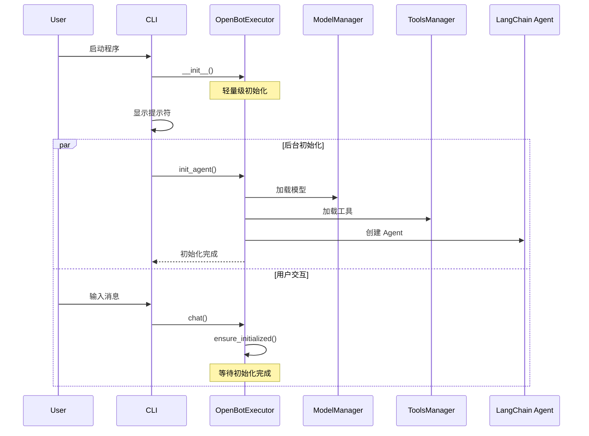
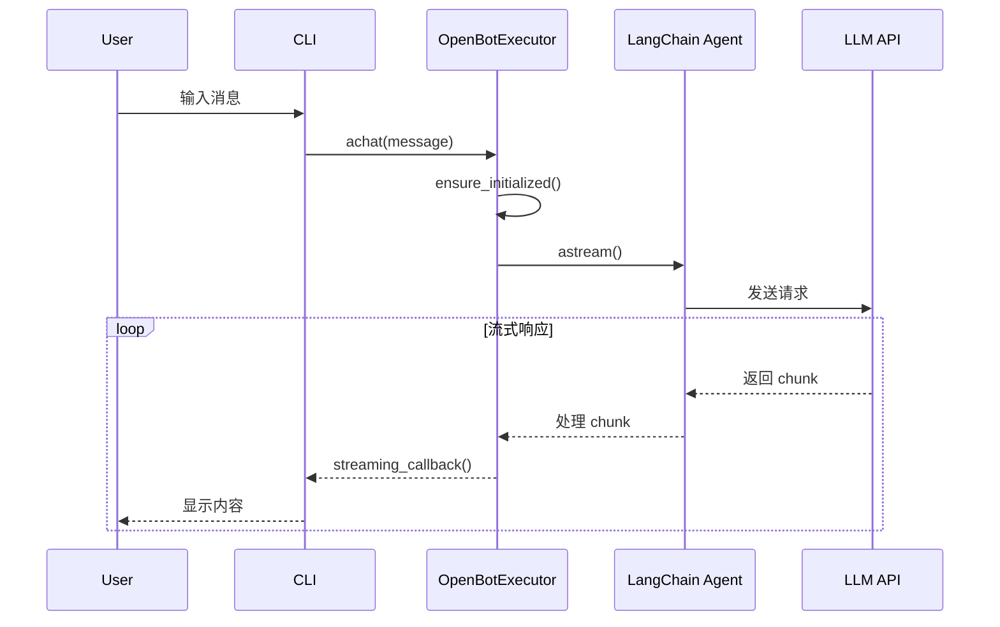
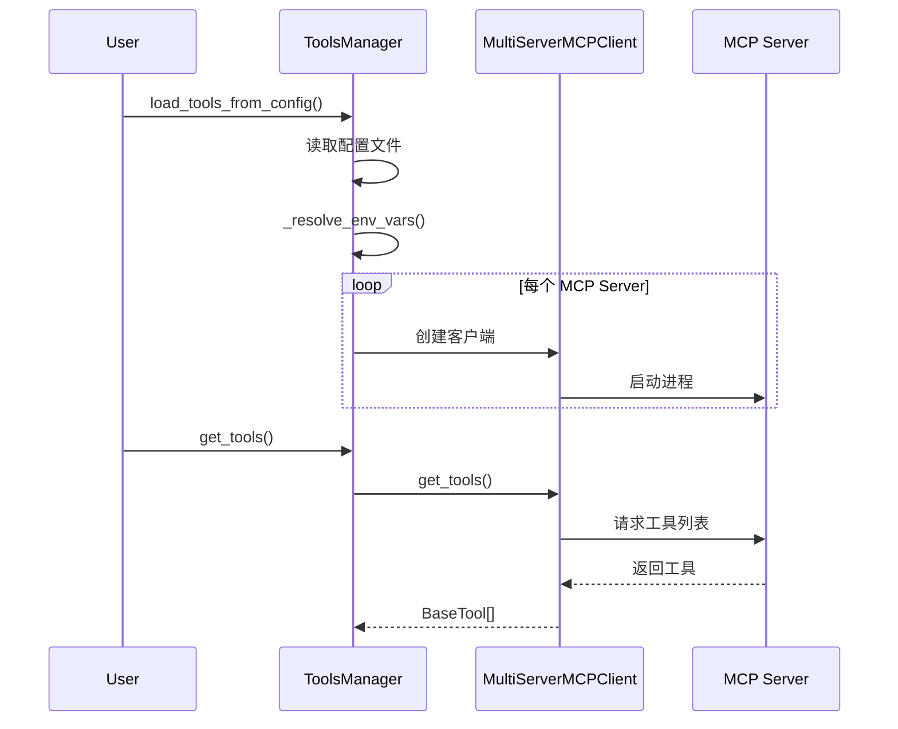
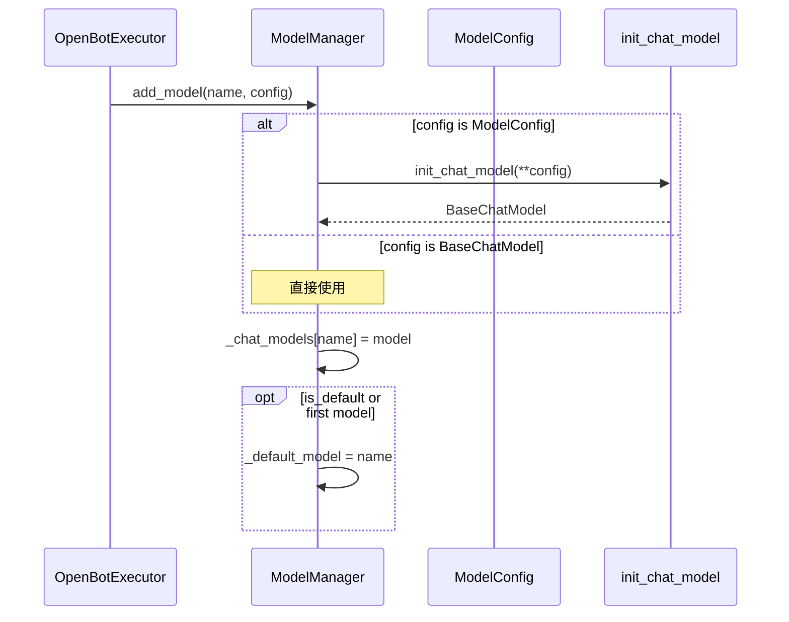
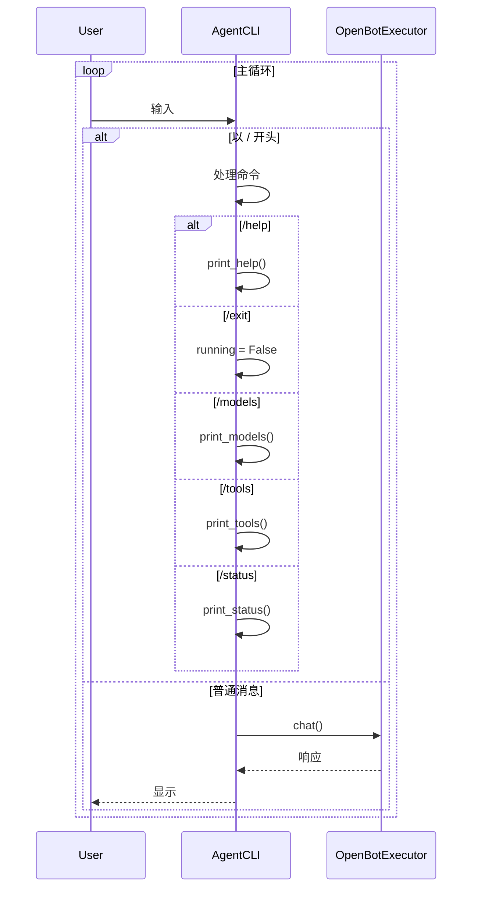
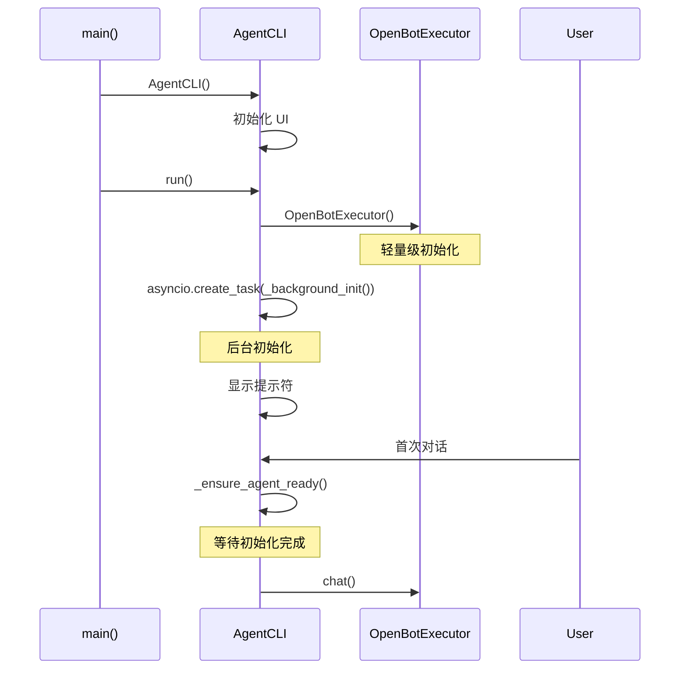

# OpenBot v0.2.0 详细设计文档

## 1. 系统架构

### 1.1 架构概述

OpenBot v0.2.0 采用分层架构设计，将系统划分为四个核心模块：

1. **智能代理核心层 (agents/core.py)** - 负责 Agent 的生命周期管理和对话协调
2. **工具管理层 (agents/tools.py)** - 负责 MCP 工具的加载和管理
3. **模型管理层 (agents/models.py)** - 负责 LLM 模型的配置和切换
4. **控制台界面层 (agents/cli.py)** - 负责用户交互和命令处理

架构设计遵循以下原则：
- **单一职责原则**：每个模块只负责一个明确的功能领域
- **依赖倒置原则**：上层模块依赖抽象接口，不依赖具体实现
- **懒加载策略**：延迟初始化耗时资源，优化启动性能

### 1.2 模块划分

```
┌─────────────────────────────────────────────────────────────┐
│                      用户交互层                               │
│                   (agents/cli.py)                           │
│  ┌──────────────┐  ┌──────────────┐  ┌──────────────┐      │
│  │   命令处理    │  │   消息显示    │  │   后台初始化  │      │
│  └──────────────┘  └──────────────┘  └──────────────┘      │
└──────────────────────────┬──────────────────────────────────┘
                           │
┌──────────────────────────▼──────────────────────────────────┐
│                    智能代理核心层                             │
│                  (agents/core.py)                           │
│  ┌──────────────┐  ┌──────────────┐  ┌──────────────┐      │
│  │  对话管理     │  │  流式处理     │  │  重试机制     │      │
│  └──────────────┘  └──────────────┘  └──────────────┘      │
└──────────────────────────┬──────────────────────────────────┘
                           │
        ┌──────────────────┼──────────────────┐
        │                  │                  │
┌───────▼──────┐  ┌────────▼────────┐  ┌──────▼───────┐
│   工具管理层   │  │    模型管理层     │  │   配置管理    │
│(agents/tools)│  │ (agents/models) │  │(config.py)  │
└──────────────┘  └─────────────────┘  └──────────────┘
```

### 1.3 数据流图

```
用户输入 → CLI → OpenBotExecutor → Agent → LLM API
                     ↓
                ToolsManager → MCP Servers
                     ↓
                流式响应 → CLI 显示
```

**数据流说明：**
1. 用户通过 CLI 输入消息
2. CLI 调用 OpenBotExecutor 处理消息
3. OpenBotExecutor 协调 ToolsManager 和 ModelManager
4. Agent 调用 LLM API 生成响应
5. 响应通过流式方式返回给用户

---

## 2. 模块详细设计

### 2.1 agents/core.py - 智能代理核心

#### 2.1.1 类图

```
┌─────────────────────────────────────────────────────────────┐
│                    OpenBotExecutor                          │
├─────────────────────────────────────────────────────────────┤
│ - _agent_config: AgentConfig                                │
│ - _model_configs: Dict[str, Any]                            │
│ - _model_manager: ModelManager                              │
│ - _tools_manager: ToolsManager                              │
│ - _agent: Any                                               │
│ - _initialized: bool                                        │
│ - _initializing: bool                                       │
│ - _init_error: Optional[Exception]                          │
├─────────────────────────────────────────────────────────────┤
│ + __init__(model_configs, agent_config)                     │
│ + init_agent() -> None                                      │
│ + ensure_initialized() -> None                              │
│ + chat(message, streaming_callback) -> List[ChatMessage]    │
│ + achat(message, streaming_callback, max_retries)           │
│   -> List[ChatMessage]                                      │
│ - _do_init() -> None                                        │
│ - _handle_message_chunk(chunk, message, callback)           │
│   -> List[ChatMessage]                                      │
│ + is_initialized: bool                                      │
│ + is_initializing: bool                                     │
│ + model_manager: ModelManager                               │
│ + agent: Any                                                │
└─────────────────────────────────────────────────────────────┘
```

#### 2.1.2 OpenBotExecutor 详细设计

**职责：**
- 管理 Agent 的生命周期（初始化、运行、销毁）
- 协调模型和工具的加载
- 处理用户对话请求
- 实现工具调用重试机制

**关键属性：**

| 属性 | 类型 | 说明 |
|------|------|------|
| `_initialized` | bool | 初始化完成标志 |
| `_initializing` | bool | 初始化进行中标志 |
| `_init_error` | Exception | 初始化错误信息 |
| `_agent` | Any | LangChain Agent 实例 |

**设计决策：**
1. **懒加载模式**：构造函数不进行耗时操作，首次使用时初始化
2. **状态机模式**：使用 `_initialized` 和 `_initializing` 管理初始化状态
3. **单例模式**：每个 OpenBotExecutor 实例管理一个 Agent

#### 2.1.3 初始化流程



**初始化步骤：**
1. 构造函数初始化轻量级对象
2. 后台异步初始化模型和工具
3. 首次对话时确保初始化完成

#### 2.1.4 对话流程



#### 2.1.5 重试机制设计

**重试策略：**
- **最大重试次数**：3 次
- **退避策略**：指数退避（1s → 2s → 4s）
- **重试条件**：工具调用错误（网络、超时等）

**算法流程：**
```python
for attempt in range(max_retries + 1):
    try:
        return await execute()
    except ToolError as e:
        if attempt < max_retries and is_retryable(e):
            await sleep(delay)
            delay *= 2  # 指数退避
        else:
            raise
```

**设计理由：**
1. **指数退避**：避免对故障服务造成压力
2. **选择性重试**：只对可重试错误进行重试
3. **用户透明**：重试过程对用户不可见

---

### 2.2 agents/tools.py - 工具管理

#### 2.2.1 类图

```
┌─────────────────────────────────────────────────────────────┐
│                    ToolsManager                             │
├─────────────────────────────────────────────────────────────┤
│ - _mcp_configs: Dict[str, Dict]                             │
│ - _clients: List[MultiServerMCPClient]                      │
├─────────────────────────────────────────────────────────────┤
│ + __init__()                                                │
│ + load_tools_from_config(config_path) -> Tuple[bool, List]  │
│ + load_tools_from_dict(mcp_configs) -> bool                 │
│ + get_tools() -> List[BaseTool]                             │
│ - _resolve_env_vars(config_dict) -> Dict                    │
└─────────────────────────────────────────────────────────────┘
```

#### 2.2.2 ToolsManager 详细设计

**职责：**
- 管理 MCP 服务器配置
- 加载和获取工具
- 解析环境变量

**设计决策：**
1. **配置分离**：支持配置文件和字典两种方式加载
2. **环境变量支持**：使用 `${VAR_NAME}` 语法
3. **异步获取**：工具获取使用异步接口

#### 2.2.3 MCP 集成设计

**MCP 架构：**
```
ToolsManager → MultiServerMCPClient → MCP Server (stdio/sse)
                     ↓
                BaseTool[]
```

**支持的传输方式：**
- **stdio**：本地进程通信（默认）
- **sse**：服务器发送事件（HTTP）

#### 2.2.4 工具加载流程



---

### 2.3 agents/models.py - 模型管理

#### 2.3.1 类图

```
┌─────────────────────────────────────────────────────────────┐
│                    ModelManager                             │
├─────────────────────────────────────────────────────────────┤
│ - _default_model: str                                       │
│ - _strategy: Literal["auto", "manual"]                      │
│ - _chat_models: Dict[str, BaseChatModel]                    │
├─────────────────────────────────────────────────────────────┤
│ + __init__(strategy, default_model)                         │
│ + add_model(name, model, is_default)                        │
│ + get_model(name) -> BaseChatModel                          │
│ + list_models() -> Dict[str, Any]                           │
└─────────────────────────────────────────────────────────────┘
```

#### 2.3.2 ModelManager 详细设计

**职责：**
- 管理多个 LLM 模型配置
- 支持模型切换策略
- 提供模型访问接口

**策略模式：**
- **manual**：手动指定模型
- **auto**：随机选择非默认模型

**设计决策：**
1. **策略模式**：支持不同的模型选择策略
2. **默认模型**：第一个添加的模型自动设为默认
3. **随机选择**：auto 策略使用 random.choice 实现负载均衡

#### 2.3.3 模型加载流程



---

### 2.4 agents/cli.py - 控制台界面

#### 2.4.1 类图

```
┌─────────────────────────────────────────────────────────────┐
│                      AgentCLI                               │
├─────────────────────────────────────────────────────────────┤
│ - console: Console                                          │
│ - agent: OpenBotExecutor                                    │
│ - running: bool                                             │
│ - session: PromptSession                                    │
│ - prompt: str                                               │
│ - channel_id: str                                           │
│ - _current_response_started: bool                           │
├─────────────────────────────────────────────────────────────┤
│ + __init__()                                                │
│ + print_banner()                                            │
│ + print_help()                                              │
│ + print_models()                                            │
│ + print_tools()                                             │
│ + print_status()                                            │
│ + handle_streaming_message(message) -> ChatMessage          │
│ - _background_init()                                        │
│ - _ensure_agent_ready() -> bool                             │
│ + chat(user_input)                                          │
│ + run()                                                     │
└─────────────────────────────────────────────────────────────┘
```

#### 2.4.2 AgentCLI 详细设计

**职责：**
- 提供交互式命令行界面
- 处理用户输入和命令
- 显示流式响应
- 管理后台初始化

**UI 组件：**
- **Rich Console**：美化输出，支持 Markdown
- **Prompt Toolkit**：命令历史、自动补全
- **主题系统**：可定制的配色方案

#### 2.4.3 命令处理流程



#### 2.4.4 懒加载设计

**启动流程：**


**设计理由：**
1. **快速启动**：用户无需等待初始化完成
2. **后台处理**：利用异步避免阻塞主线程
3. **自动等待**：首次对话时自动等待初始化

---

## 3. 接口设计

### 3.1 内部接口

#### 3.1.1 OpenBotExecutor 接口

```python
class OpenBotExecutor:
    def __init__(self, model_configs: Dict[str, Any], agent_config: AgentConfig)
    async def init_agent(self) -> None
    async def ensure_initialized(self) -> None
    def chat(self, message: ChatMessage, streaming_callback: Callable | None = None) -> List[ChatMessage]
    async def achat(self, message: ChatMessage, streaming_callback: Callable | None = None, max_retries: int = 3) -> List[ChatMessage]
    
    @property
    def is_initialized(self) -> bool
    @property
    def is_initializing(self) -> bool
    @property
    def model_manager(self) -> ModelManager
    @property
    def agent(self) -> Any
```

#### 3.1.2 ToolsManager 接口

```python
class ToolsManager:
    def __init__(self)
    def load_tools_from_config(self, config_path: str) -> Tuple[bool, List[BaseTool]]
    def load_tools_from_dict(self, mcp_configs: dict) -> bool
    async def get_tools(self) -> List[BaseTool]
```

#### 3.1.3 ModelManager 接口

```python
class ModelManager:
    def __init__(self, strategy: Literal["auto", "manual"] = "auto", default_model: str = "")
    def add_model(self, name: str, model: Union[BaseChatModel, ModelConfig], is_default: bool = False)
    def get_model(self, name: str = None) -> BaseChatModel
    def list_models(self) -> Dict[str, Any]
```

### 3.2 外部接口

#### 3.2.1 CLI 接口

**启动命令：**
```bash
python -m openbot.agents.cli
```

**环境变量：**
- `OPENBOT_CONFIG_PATH` - 配置文件路径
- `OPENBOT_LOG_LEVEL` - 日志级别

**交互命令：**
- `/help` - 显示帮助
- `/exit`, `/quit` - 退出
- `/clear` - 清屏
- `/models` - 显示模型
- `/tools` - 显示工具
- `/status` - 显示状态

#### 3.2.2 配置文件接口

**主配置：** `config/config.json`
```json
{
  "model_configs": {
    "model-name": {
      "model_provider": "openai",
      "model": "gpt-4o",
      "api_key": "${OPENAI_API_KEY}",
      "temperature": 0.7
    }
  },
  "agent_config": {
    "workspace": "./workspace",
    "mcp_config": "config/mcp.json",
    "default_model": "model-name"
  }
}
```

**MCP 配置：** `config/mcp.json`
```json
{
  "mcpServers": {
    "server-name": {
      "command": "npx",
      "args": ["-y", "@modelcontextprotocol/server-fetch"]
    }
  }
}
```

---

## 4. 数据设计

### 4.1 数据模型

#### 4.1.1 ChatMessage

```python
class ChatMessage:
    channel_id: str          # 频道标识
    msg_id: Optional[str]    # 消息 ID
    content: str             # 消息内容
    role: str               # 角色（user/bot）
    content_type: ContentType # 内容类型
    metadata: Dict[str, Any] # 元数据
```

#### 4.1.2 AgentConfig

```python
class AgentConfig:
    workspace: str           # 工作区路径
    mcp_config: str         # MCP 配置文件路径
    default_model: str      # 默认模型名称
    debug: bool             # 调试模式
    memory: bool            # 是否启用记忆
    skills: List[str]       # 技能列表
```

#### 4.1.3 ModelConfig

```python
class ModelConfig:
    model_provider: str     # 模型提供商
    model: str              # 模型名称
    api_key: Optional[str]  # API 密钥
    temperature: float      # 温度参数
    base_url: str          # API 基础 URL
```

### 4.2 配置文件格式

**配置层次：**
```
config/
├── config.json          # 主配置
├── mcp.json            # MCP 服务器配置
└── skills/             # 技能配置
    └── *.py
```

**配置加载顺序：**
1. 读取主配置文件
2. 解析环境变量
3. 加载 MCP 配置
4. 初始化模型和工具

---

## 5. 错误处理设计

### 5.1 异常分类

| 异常类型 | 说明 | 处理方式 |
|---------|------|----------|
| `InitializationError` | 初始化失败 | 记录日志，提示用户 |
| `ToolExecutionError` | 工具执行失败 | 重试机制，3次后报错 |
| `ModelNotFoundError` | 模型未找到 | 提示可用模型列表 |
| `ConfigError` | 配置错误 | 显示配置示例 |
| `NetworkError` | 网络错误 | 自动重试 |

### 5.2 错误处理策略

**分层处理：**
1. **底层（工具/模型）**：捕获并包装异常
2. **核心层（Executor）**：实现重试逻辑
3. **界面层（CLI）**：友好提示用户

**错误处理流程：**
```python
try:
    result = await execute()
except ToolExecutionError as e:
    if should_retry(e):
        await retry()
    else:
        log_error(e)
        raise UserFriendlyError(str(e))
```

---

## 6. 性能设计

### 6.1 懒加载策略

**实现方式：**
1. 构造函数只初始化轻量级对象
2. 耗时操作（模型加载、工具连接）延迟到首次使用
3. 后台异步初始化，不阻塞主线程

**性能指标：**
- 启动时间：< 1 秒
- 首次对话延迟：< 3 秒（含初始化）
- 后续对话延迟：< 100ms

### 6.2 缓存策略

**缓存内容：**
- 模型实例（避免重复创建）
- 工具列表（减少 MCP 调用）
- 配置解析结果

**缓存更新：**
- 模型：程序生命周期内不变
- 工具：按需刷新
- 配置：重启后重新加载

### 6.3 重试策略

**指数退避算法：**
```python
delay = initial_delay * (2 ** attempt)
```

**参数：**
- 初始延迟：1 秒
- 最大重试：3 次
- 最大延迟：8 秒

---

## 7. 安全设计

### 7.1 输入验证

**验证内容：**
- 配置文件格式（JSON Schema）
- 环境变量存在性
- 命令参数合法性

**验证方式：**
- Pydantic 模型验证
- 运行时类型检查
- 边界值检查

### 7.2 命令执行安全

**安全措施：**
1. **危险命令过滤**：禁止 `rm -rf /` 等危险命令
2. **超时限制**：命令执行超时 30 秒
3. **沙箱环境**：在指定工作区内执行
4. **日志记录**：记录所有执行的命令

**安全策略：**
```python
DANGEROUS_PATTERNS = [
    r'rm\s+-rf\s+/',
    r'>\s*/dev/',
    r'mkfs',
    r'dd\s+if=',
]

def is_safe_command(cmd: str) -> bool:
    for pattern in DANGEROUS_PATTERNS:
        if re.search(pattern, cmd):
            return False
    return True
```

---

## 8. 测试设计

### 8.1 单元测试策略

**测试范围：**
- 所有公共方法
- 边界条件
- 异常场景

**测试框架：**
- pytest：测试框架
- pytest-asyncio：异步测试
- unittest.mock：模拟依赖

**测试文件：**
- `tests/unit/test_agent.py` - core.py 测试
- `tests/unit/test_tools.py` - tools.py 测试
- `tests/unit/test_models.py` - models.py 测试
- `tests/unit/test_cli.py` - cli.py 测试

### 8.2 集成测试策略

**测试场景：**
- 完整对话流程
- 工具调用流程
- 多模型切换
- 错误恢复

**测试文件：**
- `tests/integration/test_system.py` - 系统集成测试

### 8.3 覆盖率目标

| 模块 | 目标覆盖率 | 当前覆盖率 |
|------|-----------|-----------|
| core.py | 90% | ~5% |
| tools.py | 90% | ~10% |
| models.py | 90% | ~5% |
| cli.py | 80% | ~0% |

**覆盖率工具：**
- pytest-cov：覆盖率统计
- coverage.py：详细报告

---

## 9. 设计决策记录

### 9.1 决策 1：懒加载 vs 预加载

**问题：** 启动时加载所有资源还是按需加载？

**方案：**
- A：预加载 - 启动时加载所有模型和工具
- B：懒加载 - 按需加载资源

**决策：** 选择 B（懒加载）

**理由：**
1. 用户体验：快速启动，减少等待
2. 资源效率：只加载需要的资源
3. 故障隔离：单个资源失败不影响整体

### 9.2 决策 2：同步 vs 异步

**问题：** 使用同步还是异步接口？

**方案：**
- A：同步 - 简单直接
- B：异步 - 性能更好

**决策：** 选择 B（异步）

**理由：**
1. 性能：支持并发操作
2. 响应性：不阻塞 UI
3. 生态：LangChain 原生支持异步

### 9.3 决策 3：重试机制位置

**问题：** 在哪里实现重试机制？

**方案：**
- A：工具层 - 每个工具自己实现
- B：核心层 - OpenBotExecutor 统一处理
- C：Agent 层 - LangChain Agent 处理

**决策：** 选择 B（核心层）

**理由：**
1. 统一策略：所有工具使用相同的重试策略
2. 可配置：用户可以控制重试行为
3. 透明性：工具无需关心重试逻辑

---

## 10. 附录

### 10.1 术语表

| 术语 | 定义 |
|------|------|
| Agent | 智能代理，能够理解和执行用户指令的 AI 系统 |
| MCP | Model Context Protocol，模型上下文协议 |
| LLM | Large Language Model，大型语言模型 |
| 懒加载 | 延迟初始化策略 |
| 流式响应 | 逐步返回 AI 生成内容 |

### 10.2 参考资料

- [LangChain 文档](https://python.langchain.com/)
- [MCP 协议规范](https://modelcontextprotocol.io/)
- [DeepAgents 文档](https://github.com/langchain-ai/deepagents/)

---

**文档版本:** v0.2.0  
**最后更新:** 2026-02-24  
**作者:** OpenBot Team
